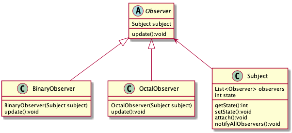

# 如何使用 Watch 机制实现分布式通知
学习了 ZooKeeper 数据模型中的节点相关知识，并利用节点的特性实现了几个业务场景。
本节课我们来学习 ZooKeeper 又一关键技术——Watch 监控机制，并用它实现一个发布订阅功能。

在日常生活中也有很多订阅发布的场景。比如我们喜欢观看某一个剧集，视频网站会有一个订阅按钮，用户可以订阅自己喜欢的电视剧，
当有新的剧集发布时，网站会通知该用户第一时间观看。或者我们在网站上看到一件心仪的商品，但是当前没有库存，网站会提供到货通知的功能，
我们开启这个商品的到货通知功能后，商品补货的时候会通知我们，之后就可以进行购买了。ZooKeeper 中的 Watch 机制很像这些日常的应用场景，
其中的客户端就是用户，而服务端的数据节点就好像是我们订阅的商品或剧集。

现在我们可以从技术实现的角度分析一下上边提到的这些场景，无论是订阅一集电视剧还是订购一件商品。
都有几个核心节点，即用户端注册服务、服务端处理请求、客户端收到回调后执行相应的操作。
接下来我们也带着这个观点来看一下 ZooKeeper 中的 Watch 机制是如何实现的。

## Watch 机制是如何实现的

正如我们可以通过点击视频网站上的”收藏“按钮来订阅我们喜欢的内容，ZooKeeper 的客户端也可以通过 Watch 机制来订阅当服务器上某一节点的数据或状态发生变化时收到相应的通知，
我们可以通过向 ZooKeeper 客户端的构造方法中传递 Watcher 参数的方式实现：

```java
new ZooKeeper(String connectString, int sessionTimeout, Watcher watcher)

connectString 服务端地址

sessionTimeout:超时时间

Watcher:监控事件
```

这个 Watcher 将作为整个 ZooKeeper 会话期间的上下文 ，一直被保存在客户端 ZKWatchManager 的 defaultWatcher 中。

除此之外，ZooKeeper 客户端也可以通过 getData、exists 和 getChildren 三个接口来向 
ZooKeeper 服务器注册 Watcher，从而方便地在不同的情况下添加 Watch 事件:

```java
getData(String path, Watcher watcher, Stat stat)
```

知道了 ZooKeeper 添加服务器监控事件的方式，下面我们来讲解一下触发通知的条件。


上图中列出了客户端在不同会话状态下，相应的在服务器节点所能支持的事件类型。例如在客户端连接服务端的时候，
可以对数据节点的创建、删除、数据变更、子节点的更新等操作进行监控。

现在我们已经从应用层的角度了解了 ZooKeeper 中的 Watch 机制，而学习 ZooKeeper 过程中一个大问题就是入门容易精通难，
像上边我们通过几个简单的 API 调用就可以对服务器的节点状态变更进行监控，但是在实际生产环境中我们会遇到很多意想不到的问题，
要想解决好这些问题就要深入理解 Watch 的底层实现机制。

## Watch 机制的底层原理

现在我们就深入底层了解其背后的实现原理。与上个课时直接通过底层代码的调用过程来分析不同，在 Watch 底层实现的分析阶段，
由于 Watch 机制涉及了客户端和服务端的多个函数和操作节点，单单按照程序执行流程分析跳跃性对整体实现机制的理解难度大，
这也是我在学习 Watch 这部分底层实现遇到的问题。为了更好地阐述 Watch 机制，我们另辟蹊径，从设计模式角度出发来分析其底层实现：


最初我在开始学习 Watch 机制的时候，它给我的第一印象是，其结构很像设计模式中的”观察者模式“，一个对象或者数据节点可能会被多个客户端监控，
当对应事件被触发时，会通知这些对象或客户端。我们可以将 Watch 机制理解为是分布式环境下的观察者模式。
所以接下来我们就以观察者模式的角度点来看看 ZooKeeper 底层 Watch 是如何实现的。



通常我们在实现观察者模式时，最核心或者说关键的代码就是创建一个列表来存放观察者。 而在ZooKeeper 中则是在客户端和服务器端分别实现两个存放观察者列表，
即：ZKWatchManager 和 WatchManager。其核心操作就是围绕着这两个展开的。

**客户端 Watch 注册实现过程**

我们先看一下客户端的实现过程，在发送一个 Watch 监控事件的会话请求时，ZooKeeper 客户端主要做了两个工作:
- 标记该会话是一个带有 Watch 事件的请求
- 将 Watch 事件存储到 ZKWatchManager

我们以 getData 接口为例。当发送一个带有 Watch 事件的请求时，客户端首先会把该会话标记为带有 Watch 监控的事件请求，
之后通过 DataWatchRegistration 类来保存 watcher 事件和节点的对应关系：

```java
public byte[] getData(final String path, Watcher watcher, Stat stat){

  ...

  WatchRegistration wcb = null;

  if (watcher != null) {

    wcb = new DataWatchRegistration(watcher, clientPath);

  }

  RequestHeader h = new RequestHeader();

  request.setWatch(watcher != null);

  ...

  GetDataResponse response = new GetDataResponse();

  ReplyHeader r = cnxn.submitRequest(h, request, response, wcb);

  }
```


