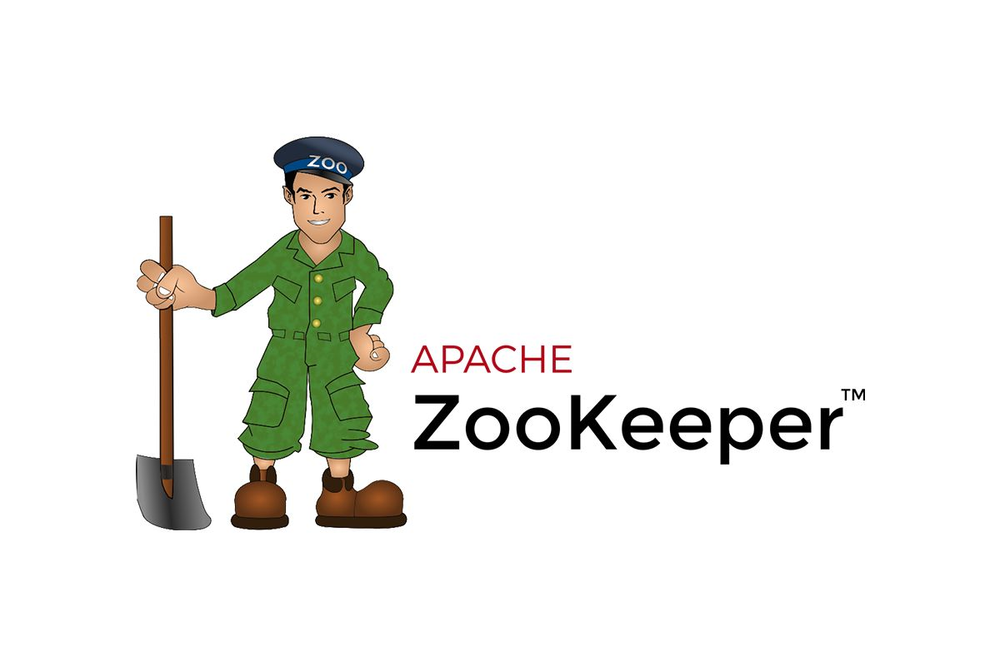

# Zookeeper-Principle
> Depth understanding of the principles of the Zookeeper and source code in project.
> Zookeeper URL: https://zookeeper.apache.org/

-----------------------------------------------------------------------------------------------
其他平台将同步更新

- Github：https://github.com/2462612540
- Gitee：https://gitee.com/xjl2462612540
- CSDN：https://blog.csdn.net/weixin_41605937?spm=1001.2014.3001.5343

<mark>**整理不易，还望各位看官一键三连 :heart: :heart: :heart: **</mark>
<mark>**整理不易，还望各位看官一键三连 :heart: :heart: :heart: **</mark>

-----------------------------------------------------------------------------------------------
## Zookeeper Xmind

- zookeeper图书资源.txt

## Zookeeper Basic Principle

- 1.Zookeeper整体系统架构原理

## Zookeeper Source Code Analysis
- https://github.com/2462612540/ZookeeperPrinciple

## Zookeeper Interview Questions

# Project Summary

本项目所有内容来源于个人总结而形成。同时大部分内容是学习互联网上的相关知识和翻阅相关书籍原著获得，所以在一些知识的理解上可能存在错误，肯请各位大佬及时指出。
另外项目中部分图像是直接引用而来，如果涉及到相关的版权问题，请及时联系我我的邮箱是：18279148786@163.com 本人将立即改正。
